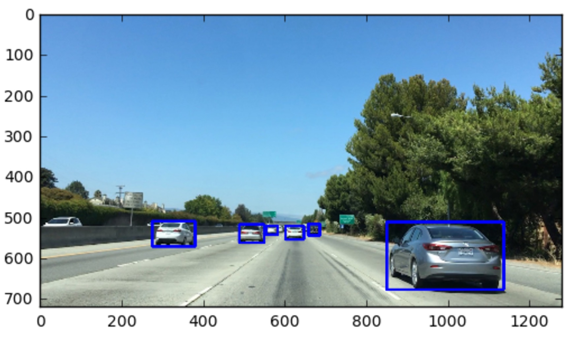

# Vehicle Detection Machine Learning Nanodegree Capstone Project Report

## Overview

A key problem for self-driving cars is the detection of other vehicles on the road.  This kind of object detection traditionally has been  done with proximity sensors like radars and LIDARS.  With machine learning and computer vision, vehicle detection can also be done using cameras.  The basic approach is to identify visual features such as color gradients, edges, contrasts, etc. that distinguishes vehicles from the roads and the surrounding scenery, and then use supervised learning to classify feature sets from various regions in a camera image as vehicles or not.  The image below shows several cars detected in a camera image.

Source: Udacity Self-Driving Car Vehicle Detection and Tracking Project

Even within this machine learning approach, there are several distinct methods to detect vehicles.  In recent years there have been a number of advances in object detection that identifies and localizes objects in a image, including single-shot detectors that perform object detection with a single convolution neural network.  The deep learning approach automates the feature extraction step during the training process, so all that is needed is a good set of training data.  While this has been shown to work well (see https://www.youtube.com/watch?v=qrL7ko_ARb0 for one example), the magic of this approach is hidden within the deep learning black box.

This project takes another method using support vector machine to perform the binary classification of whether an image region contains a vehicle (or part thereof) using a human-selected set of visual features.  One key purpose of this approach is to provide a deeper understanding of the underlying mechanism behind visual vehicle detection using machine learning.  As such, this project will include an exploration of the kinds of visual features that could be useful in distinguishing cars from the road and the surrounding scenery, the extraction of these features from regions in the images, and the classification of the the features as vehicle or not.

## Problem Statement

The problem addressed by this project is detection of vehicles in camera images.  

While one key application of this kind of work is detecting other vehicles on the road using cameras mounted on self-driving cars, this is not the scope of this project.  Creating a robust vehicle detector for real-world use in self-driving cars is a large problem in both accuracy and computational performance that requires a dedicated team and massive data collection.

This project only seeks to demonstrate the approach of classifying vehicles in images with machine learning for instructional purposes.

## Metrics

The metric for success in this approach will be reasonable performance on a video of highway driving provided by Udacity as part of the Vehicle Detection and Tracking Project in its Self-Driving Car Nanodegree program.  The metric is subjective due to instructional purpose of this project.

## Analysis

